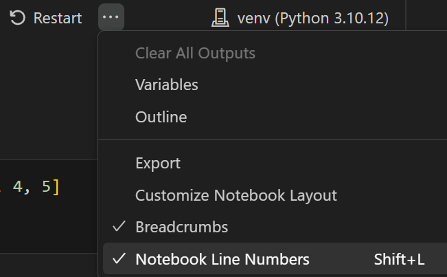

# Jupyter Notebook eksperimentinės aplinkos integracija su VS Code

## Įvadas

Jupyter Notebook yra atvirojo kodo internetinė programa, leidžianti naudotojams kurti ir dalintis dokumentais, kuriuose yra programos kodas, lygtys, vizualizacijos ir tekstas. Ji suteikia interaktyvią aplinką, kurioje galite rašyti ir vykdyti kodą, peržiūrėti rezultatus ir pridėti paaiškinamąjį tekstą Markdown formatu.
Jupyter Notebook leidžia vykdyti atskirus kodus, tai palengvina testuoti ir derinti kodą. Galite modifikuoti ir pakartotinai paleisti konkrečias kodo dalis, tai leidžia sparčiau vystyti programą.
Iš esmės, naudojant Jupyter "Notebook" kaip eksperimentinę aplinką "VS Code", galima gauti interaktyvius, vizualius ir bendradarbiavimo funkcionalumus, kurie naudingi duomenų tyrinėjimui, prototipavimui ir dokumentavimui. Tačiau gali būti apribojimų, susijusių su kodo struktūra, versijų kontrolė, našumu ir pažangiomis IDE funkcijomis. Pasirinkimas tarp Jupyter "Notebook" ir įprastų .py failų priklauso nuo jūsų projekto konkretaus naudojimo atvejo ir reikalavimų.

# Diegimas ir "VS Code" integracija

Norint sukonfigūruoti Jupyter "Notebook" "VS Code" integruotoje aplinkoje, laikykitės šių žingsnių:

1. Įdiekite Jupyter plėtinį: Atidarykite "VS Code", eikite į Plėtinių peržiūros langą (`Ctrl+Shift+X`/`Cmd+Shift+X` or `View` > `Extensions` in menu) ir ieškokite "Jupyter". Įdiekite Jupyter plėtinį, jei jis dar nėra įdiegtas su Python.

2. Sukurkite naują Jupyter "Notebook" failą: Atidarykite Komandų Paletę (`Ctrl+Shift+P` or `View` > `Command Palette`) ir ieškokite "Jupyter: Create New Blank Jupyter Notebook". Pasirinkite šią parinktį, kad sukurtumėte naują Jupyter "Notebook" failą. Alternatyviai, galite tiesiog sukurti tuščią failą Failų naršyklėje ir pavadinti jį su plėtiniu .ipynb.

3. Pasirinkite kernel: Po naujo "Notebook" sukūrimo jums bus paprašyta pasirinkti kernel. Pasirinkite neseniai sukurtą virtualią aplinką (`venv`)  ir jei paprašoma, leiskite prieigą per "Windows" ugniasienę.

4. Vykdykite kodo dalį: Naujai sukurtame Jupyter "Notebook" faile, galite pradėti rašyti ir vykdyti kodo dalį naudojant Ctrl+Enter sutrumpinimą arba tiesiog paspaudę trikampio mygtuką kairėje kodo dalies pusėje. Kiekviena kodo dalis gali būti vykdoma nepriklausomai, o paskutinės kodo eilutės rezultatas bus rodomas žemiau eilutės.

5. Jums bus paprašyta įdiegti interaktyvius Python ir Jupyter modulius į jūsų Python virtualią aplinką, jei jų dar nėra. Pasirinkite parinktį Install. Tai gali užtrukti šiek tiek laiko. Klaidos atveju, galite bandyti dar kartą, vykdydami komandą "pip install ipykernel" terminalo lange, bet pirmiausia įsitikinkite, kad virtualioji aplinka yra aktyvuota.

Sėkmingo diegimo atveju, jūsų kodo dalis bus sėkmingai įvykdyta ir rezultatas bus išvestas.

Papildomos funkcijos: Jupyter plėtinys "VS Code" suteikia įvairių funkcijų, tokių kaip kodo autoužpildymas, kodo formatavimas ir derinimo galimybės. Galite pasiekti šias funkcijas per "VS Code" sąsają, kad pagerintumėte savo Jupyter "Notebook" patirtį.

Išsaugojimas ir bendrinimas: Jūs galite išsaugoti savo Jupyter "Notebook" taip pat kaip bet kokį kitą failą "VS Code". Jis bus išsaugotas su .ipynb plėtiniu. Taip pat galite bendrinti .ipynb failą su kitais, ir jie gali jį atidaryti ir vykdyti savo Jupyter "Notebook" aplinkoje.

"Notebook" kernel: Jupyter "Notebook" palaiko daugelį programavimo kalbų per skirtingus kernel. Galite pakeisti su "Notebook" susietą kernel naudodami kernel meniu įrankių juostoje. Tai leidžia dirbti su kitomis kalbomis nei Python, pvz., R ar Julia.

## Kernel perkrovimas

Dirbant su Jupyter "Notebook", kartais branduolys (vykdymo aplinka) gali užstrigti arba tapti nereaguojantis. "VS Code" aplinkoje galite greitai perkrauti branduolį:
Paspauskite Restart/Restart Kernel mygtuką (paprastai vaizduojamą kaip apvalus rodyklės simbolis) viršuje "Notebook" sąsajos.

Naudodami Komandų palečią (Ctrl+Shift+P arba View > Command Palette) pasirinkite Jupyter: Restart Kernel.
Kernel perkrovimas gali išspręsti kintamųjų konfliktus, užstrigusių skaičiavimų ir kitų problemų atvejus.

## Eilučių numerių rodymas kodo dalyje.

Yra patogu, ypač dideliuose kodo blokuose, matyti eilučių numerius kiekvienoje kodo eilutėje. Tačiau atkreipkite dėmesį, kad juos nenagrinėtumėte kaip kodo dalį. Galite įjungti eilučių numerius išplėstame Jupyter įrankių juostos meniu (...), tiesiog dešinėje nuo to Restart mygtuko.

## Vaizdų ir vizualizacijos bibliotekų rodymas

Jupyter "Notebook" palaiko integraciją su populiariomis Python vizualizacijos bibliotekomis, tokiomis kaip Matplotlib, Seaborn, Plotly ir kt. Generuojant grafikus ar vizualizacijas naudojant šias bibliotekas Jupyter "Notebook" aplinkoje "VS Code", išvestys atvaizduojamos žemiau kodo dalies, tarpinių rezultatų. Tai palengvina stebėti jūsų duomenų analizes ir vizualizacijos rezultatus realiuoju laiku. Tai bus esminė mūsų duomenų mokslinio kurso dalis.

## Kintamųjų naršyklė ir duomenų peržiūra

Jupyter plėtinys "VS Code" įtraukia kintamųjų naršyklę ir duomenų peržiūros funkciją. Tai leidžia jums peržiūrėti kintamųjų, duomenų rėmelių ir kitų duomenų struktūrų reikšmes jūsų "Notebook". Tai puikus įrankis greitai suprasti jūsų duomenų formą ir turinį.
Norėdami pasiekti kintamųjų naršyklę, išplėstame Jupyter įrankių juostos meniu (...), tiesiog dešinėje nuo to Restart mygtuko, yra ir Variables parinktis.

## Derinimas ("Debugging") Jupyter kodo daliu

"VS Code" leidžia derinti ("debugging") Jupyter kodo dalis, tai palengvina problemų sprendimą jūsų "Notebook". Norėdami pradėti derinimą:
Paspauskite ant Debug Cell piktogramos (paprastai vaizduojama kaip vabzdžio ir paleisti piktogramų kombinacija) viršuje kairėje kodo dalyje.
Derinimo įrankis pradės veikti, ir galėsite nustatyti "breakpoints", tikrinti kintamųjų reikšmes ir žingsnius per kodą.

## Klaviatūros sutrumpinimai Jupyter aplinkoje

Yra gerai paaiškinta straipsnyje, kuriame aiškinami Jupyter klaviatūros sutrumpinimai, ir visi jie veikia "VS Code" aplinkoje.
[Jupyter keyboard shortcuts](https://towardsdatascience.com/jypyter-notebook-shortcuts-bf0101a98330)

## Išvados

Integruojant Jupyter "Notebook" "VS Code" aplinkoje gauname galingą interaktyvumo, vizualizacijos ir profesionalios IDE galingų funkcijų derinį. Nesvarbu, ar jūs analizuojate duomenis, kuriate mašininio mokymosi modelius ar tiesiog kuriate prototipus, ši konfigūracija gali padidinti jūsų produktyvumą ir optimizuoti plėtros procesą.